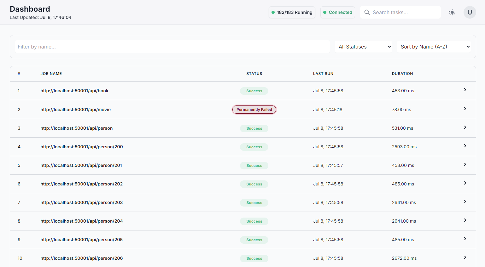
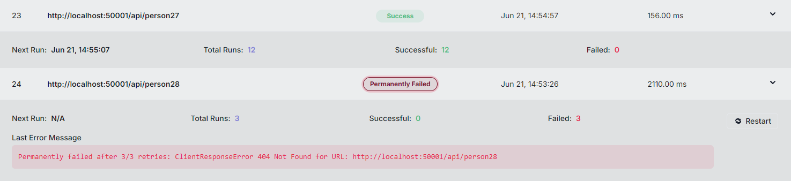

# PyScraperX

PyScraperX is a resilient, asynchronous web scraping framework built in Python. Concretely, it is designed for scheduling and concurrent execution of multiple scraping tasks whilst providing a real-time frontend UI panel for monitoring, scheduling and resubmitting failed jobs.

## Core Features

* **Async Execution**: Leverages `asyncio` and `aiohttp` for high-performance, non-blocking net I/O, enabling scraping hundreds of endpoints concurrently.
* **Background Threads**: Core scrape ops run in a background thread, ensuring that the UI and the scheduler remain responsive.
* **Real-time Control Panel UI**: Built with FastAPI, it provides a live view of all scraping jobs and allows the admin to monitor job statuses, last/next runtimes per job and performance metrics.
* **Job Control & Retry Logic**: The admin has the ability to manually resubmit failed jobs or filter by permanently deleted status and submit a batch restart.
* **Configuration Driven**: Fine grained control over run intervals, target URL paths and retry policies via `.env.local` file.
* **Mock API included**: Pre-built mock API inside the [`api/`](api/) directory makes it easy to test the overall functionality of the framework out-of-the-box.

## Dashboard Preview

The Admin UI provides a comprehensive, real-time view of all scraping jobs:



Drill down into individual jobs to see run history and error messages:



## Core Architecture

Two thread model:

1. **Main Thread**:
    * Runs the **FastAPI server** ([`report/server.py`](report/server.py)) for the frontend.
    * Runs the **Job Scheduler** ([`job_scheduler.py`](job_scheduler.py)) which utilizes the `schedule` lib to trigger tasks at predefined intervals.
2. **Background Thread**:
    * Hosts a dedicated `asyncio` event loop ([`scheduler.py`](scheduler.py)). All network bound scraping tasks are dispatched to this loop.

### Workflow

1. **Scheduling**: The `JobScheduler` in the main thread triggers the [`scrape_job`](scheduler.py) function based on the set interval.
2. **Dispatch**: [`scrape_job`](scheduler.py) uses `asyncio.run_coroutine_threadsafe` to safely dispatch `ScraperEngine.run_all()` coroutine to the bg event loop.
3. **Concurrent Scraping**: The [`ScraperEngine`](engine.py) gathers all active `WebScraper` instances and executes them using `asyncio.gather`.
4. **Fetching JSON Data**: Each [`WebScraper`](scraper.py) uses a shared `aiohttp` session for async HTTP requests and stores the JSON response data in a separate SQLite db ([`database.py`](database.py)) after validating the data with `pydantic`.
5. **Global State Management**: Each scraper, periodically updates its status in the thread-safe [`StateManager`](report/state_manager.py).
6. **UI Reports**: The FastAPI servers `/api/jobs` endpoint reads from the [`StateManager`](report/state_manager.py) to provide the latest health status and run details to the frontend, which polls the endpoint to keep the dashboard up-to-date.

## Getting Started

### Prerequisites

* Python 3.9+
* pip

### 1. Installation

Clone the repository and install the required dependencies in a new `virtualenv` from [requirements.txt](requirements.txt):
```sh
pip install -r requirements.txt
```

### 2. Configuration

* **Endpoints**: Add the URLs you want to scrape to a text file i.e., [endpoints.txt](endpoints.txt), one per line.
* **Environment**: Customize the run schedule, max retries, path to `endpoints.txt` file and other settings in the [.env.local](.env.local) file.

### 3. Run the Mock API (Optional)

The `api/` folder contains a minimal mock API that returns JSON responses for testing. Serve it with:
```sh
uvicorn api.app:app --port 50001 --reload
```

### 4. Run the Scraper Service

Start the main application from [main.py](main.py). This will start all scheduling jobs and launch the Admin UI:
```sh
python main.py
```

## Usage

Once the service is running, access the UI by navigating to **http://localhost:8000** in your web browser.

### Additional features

* Upon starting the main application a logger is instantiated, writing logs to inside a `logs/` folder, created in the current working directory. A new log file is created on every run.
* Each `.sqlite` db is stored with a unique identifier inside the `dbs/` folder in the current working directory. Records are appended if the file already exists for an endpoint.  

## Disclaimer
#### <ins>Important Legal Disclaimer</ins>
#### PyScraperX is provided for educational and informational purposes only.

By using this framework, you acknowledge and agree that you are solely responsible for complying with all applicable laws, regulations, website terms of service, and any other relevant policies when performing web scraping activities.

The creators and contributors of PyScraperX are not responsible for any misuse or illegal activities conducted by users of this software. It is your responsibility to ensure that your scraping activities are lawful and ethical. Always review a website's `robots.txt` file and terms of service before scraping.

#### Use PyScraperX responsibly and at your own risk.

## License

This project is licensed under the MIT License - see the [LICENSE](LICENSE) file for details.
