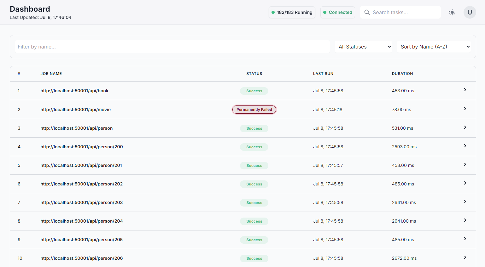

# PyScraperX

 

`PyScraperX` is a high-throughput, fully asynchronous web scraping framework built with Python. It is engineered from the ground up using `asyncio` to schedule and execute concurrent scraping tasks against JSON APIs, offering a user-friendly real-time web dashboard for monitoring, control, and operational insight.

 

## Outstanding Features

 

*   **Fully Asynchronous Architecture**: The entire stack is non-blocking. It leverages `aiohttp` for HTTP requests, `aiosqlite` for database operations, and a custom `asyncio` scheduler, ensuring maximum I/O throughput on a single thread.

*   **High-Concurrency Scraper Engine**: The `ScraperEngine` manages the scraping lifecycle, using an `asyncio.Semaphore` to enforce a configurable concurrency limit. This prevents overwhelming the target APIs while maximizing parallel execution.

*   **Real-time WebSocket Dashboard**: A reactive UI built with **FastAPI** that pushes live state updates over **WebSockets**. To minimize latency and network overhead, payloads are compressed into a binary format using `orjson` before being broadcast.

*   **Custom `asyncio` Job Scheduler**: A lightweight, dependency-free job scheduler built from scratch. It uses `asyncio.Task` to run periodic jobs, offering a fluent API (`.every_seconds(...).do(...)`) without the overhead of external libraries or threads.

*   **Non-Blocking Data Pipeline**: Data is fetched via `aiohttp`, validated against `pydantic` models in a non-blocking manner (using `asyncio.to_thread`), and persisted to dedicated SQLite databases asynchronously, ensuring the event loop is never stalled.

*   **Robust State Management & Control**: A centralized, async-safe `StateManager` with `asyncio.Lock` provides a single source of truth for job states. The UI allows for manual intervention, such as restarting individual or all permanently failed jobs.

*   **End to End Configuration with Pydantic**: The configuration system (`config.py`) uses `pydantic-settings` to swiftly load, type-check, and validate settings from `.env` files. It features strict typing (`HttpUrl`, `LogLevel`), nested models for complex settings like the Uvicorn server, custom validators, and computed properties (`run_interval`) that make the application's configuration robust & transparent.

 

## Dashboard Preview

 

The Admin UI provides a comprehensive, real-time view of all scraping jobs:

 



 

Drill down into individual jobs to see run history and error messages:

 


 

## Architecture & Data Flow

 

PyScraperX operates on a single-process, single-thread model, leveraging `asyncio`'s event loop to achieve high concurrency. This design avoids the complexities of multi-threading and simplifies state management, making it highly scalable for I/O-bound workloads.


### Workflow: A Deep Dive

 

1.  **Initialization**: The application starts a single `asyncio` event loop. The `ScraperEngine`, `JobScheduler`, and `StateManager` are initialized. The FastAPI server is launched as a background `asyncio.Task`, leaving the main coroutine free for scheduling.

 

2.  **Scheduling**: The custom `JobScheduler` is configured. For each job, it creates a long-running `asyncio.Task` that contains an infinite `async while` loop. This loop awaits the job's execution, then `await asyncio.sleep(interval)` for the specified period, all without blocking the event loop.

 

3.  **Concurrent Execution**:

    *   When a scheduled interval elapses, the `JobScheduler` triggers the `ScraperEngine`'s `run_all` method.

    *   The `ScraperEngine` first queries the `StateManager` to get the status of all jobs, filtering out any marked as `PERMANENTLY_FAILED`.

    *   It then creates a list of scraping tasks and runs them concurrently using `asyncio.gather`. Crucially, each task is wrapped in a helper that first acquires an `asyncio.Semaphore`. This elegantly limits the number of active scrapers to the configured value (e.g., 10), queuing the rest until a slot is free.

 

4.  **Data Fetching & Processing**: Each `WebScraper` instance performs the following asynchronous steps:

    *   **Fetch**: Uses a shared `aiohttp.ClientSession` to make an HTTP GET request to its target endpoint.

    *   **Validate**: The JSON response, which can be a single object or a list, is passed to a validation method. To avoid blocking the event loop with potentially CPU-intensive validation, this synchronous `pydantic` logic is run in a separate thread pool via `asyncio.to_thread`.

    *   **Store**: The validated data is passed to the `DatabaseManager`. Using `aiosqlite`, it connects to a dedicated SQLite database for that endpoint and performs an `INSERT` operation, all asynchronously.

 

5.  **State & UI Reporting**:

    *   Throughout its lifecycle, each scraper reports its status (`RUNNING`, `SUCCESS`, `FAILED`) to the central `StateManager`, which uses an `asyncio.Lock` to prevent race conditions.

    *   Meanwhile, a separate `asyncio.Task` running in the FastAPI server (`update_broadcaster`) periodically reads the entire state from `StateManager`.

    *   It serializes the state object to a compressed binary payload using `orjson` and broadcasts it over a WebSocket to all connected dashboard clients. This ensures the UI is a near-instant reflection of the backend state.

 

## Getting Started

 

### Prerequisites

 

*   Python 3.9+

*   A virtual environment tool (e.g., `venv`)

 

### 1. Installation

 

Clone the repository and install the dependencies inside a virtual environment.

 

```sh

# Create and activate a virtual environment

python -m venv venv

source venv/bin/activate  # On Windows, use `venv\Scripts\activate`

 

# Install dependencies

pip install -r requirements.txt

```

 

### 2. Configuration

 

*   **Endpoints**: Add the URLs you want to scrape to `endpoints.txt`, one URL per line.

*   **Environment**: Create a `.env.local` file by copying `.env.local.example`. Customize the run schedule, max retries, and other settings inside `.env.local`.

 

### 3. Run the Mock API (Optional)

 

The `api/` folder contains a mock API for testing. To run it, you'll need `uvicorn`.

 

```sh

# Install uvicorn if you haven't already

pip install uvicorn

 

# Run the mock API server

uvicorn api.app:app --port 50001 --reload

```

 

### 4. Run the Scraper Service

 

Start the main application. This will initialize the scheduler and launch the Admin UI.

 

```sh

python main.py

```

 

Once running, access the dashboard at **http://localhost:8000**.

 

## Legal and Ethical Disclaimer

 

#### <ins>Important: Use Responsibly</ins>

 

PyScraperX is provided for **educational and informational purposes only**. Web scraping can have significant legal and ethical implications. By using this framework, you acknowledge and agree that you are **solely responsible** for your actions.

 

Before scraping any website, you must:

 

1.  **Check the `robots.txt` file**: Respect the rules defined by the website owner (e.g., `Disallow: /api/`).

2.  **Review the Terms of Service (ToS)**: Many websites explicitly prohibit scraping in their ToS. Violating the ToS can lead to legal action or being blocked.

3.  **Be Ethical**: Do not overload a website's servers. Make requests at a reasonable rate and during off-peak hours if possible. Identify your scraper by setting a clear `User-Agent`.

4.  **Respect Copyright and Data Privacy**: Be aware of copyright laws and data privacy regulations like GDPR and CCPA. Do not scrape and use personal or copyrighted data without permission.

 

The creators and contributors of PyScraperX are not responsible for any misuse or illegal activities conducted by users of this software. **Use PyScraperX responsibly and at your own risk.**

 

## License

 

This project is licensed under the MIT License - see the [LICENSE](LICENSE) file for details.
